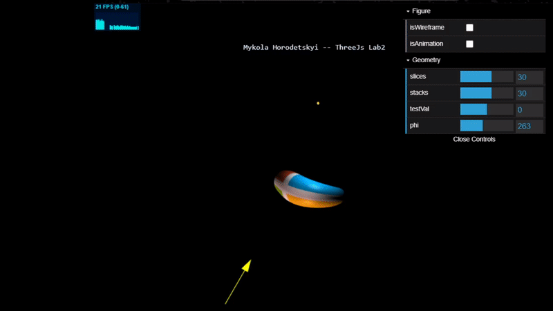

# Experiments with Graphic on the Klein Bottle geometry, using Threejs library

### Prebuilded releases [here](./docs/releases)  

### Demonstration of working application

    
    
<b>Pic.1</b> Normal and tangents vectors on the plain

    
    
<b>Pic.2</b> Direct lights and point light simulation

     

    

    

    

    

    

    

    

    

